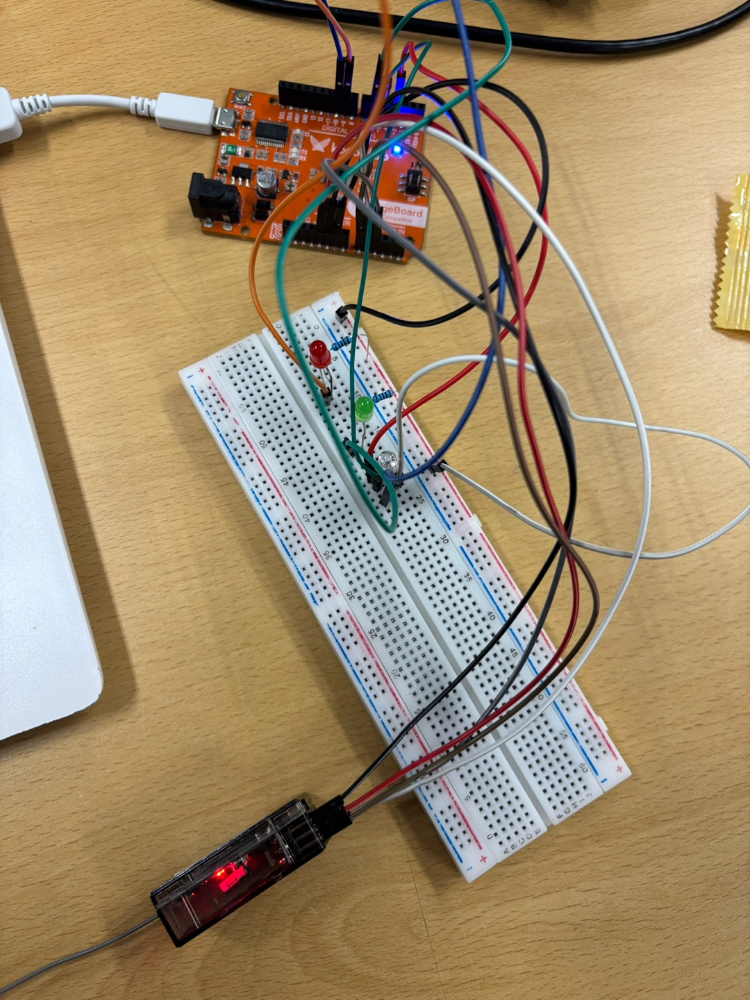

# [임베디드통신시스템] 10주차 과제 아두이노 RC 기반 PWM제어를 통한 LED 컨트롤러

## 📘 과제 설명

이번 과제는 RC 수신기(RD9)를 제어하여 CH3, CH5, CH6로부터 입력되는 PWM 신호를 읽어 아래 동작을 하는 시스템을 설계하였습니다. 
처음에 스위치를 사용해 3색 LED 색 변환을 제어하려고 하였으나 과제 조건에 맞게 색이 자연스럽게 변환되도록 수정하였습니다. 
또한, On/Off 스위치를 통해 끄고 다시 켰을 때 꺼졌던 LED가 이전 밝기 그대로 다시 켜지지 않는 오류가 있어 수정하였습니다. 

1. PWM값에 따른 LED 밝기 제어 

2. 스위치를 이용한 LED On/Off (전체 LED가 켜져있으면 이 LED가 켜져있음. / 전체 LED가 꺼져있으면 이 LED가 꺼져있음.)

3. 스위치를 이용한 3색 LED 색 변환 
    => PWM값에 따른 자연스러운 3색 LED 색 변환   
 
아두이노는 `PinChangeInterrupt` 라이브러리를 사용하여 PWM 신호의 폭을 읽고, `analogWrite()`를 통해 LED를 제어합니다.

> 파트너 : 박근호(202301648)   
> 역할 : 
> - 3색 LED 색변환을 스위치가 아닌 PWM을 이용한 자연스러운 색 변환으로 코드 수정.    
> - On/Off 스위치를 통해 끄고 다시 켰을 때 꺼졌던 LED가 이전 밝기 그대로 다시 켜지지 않는 오류 수정

> 나 : 염보은(202301657)  
> 역할 : 
> - PWM값에 따른 LED 밝기 제어, 스위치를 이용한 LED On/Off, 스위치를 이용한 3색 LED 변환의 전체적인 코드 작성 
> - 회로 구성 

---
## 시연 영상 
아래 사진을 클릭하면 동작이 시연되는 것을 확인해볼 수 있습니다.

---

## 💾 소프트웨어 구성

| 구성 요소             | 설명                                        |
|----------------------|--------------------------------------------|
| 아두이노 스케치        | PWM 신호 측정 및 LED 제어를 위한 메인 코드 |
| PinChangeInterrupt  | 아날로그 핀의 인터럽트를 처리하는 라이브러리 |
| 시리얼 모니터         | PWM 신호 및 상태 디버깅용 출력            |

### ✅ 주요 기능
- `micros()`를 활용한 PWM 펄스폭 측정  
- CH3: PWM 값을 밝기로 매핑 (1000~2000μs → 0~255)  
- CH5: LED 전체 ON/OFF 제어  
- CH6: PWM 값에 따라 색상이 변함. (빨강, 초록, 파랑)  
- 모든 LED는 CH5의 ON/OFF 상태를 따라감

---

## 🔌 하드웨어 구성

| 부품                 | 역할 및 사양                             |
|----------------------|-------------------------------------------|
| 아두이노 (UNO3)    | 전체 로직 처리용 MCU                   |
| 일반 LED (PWM 제어용) | D9 핀에 연결, 밝기 조절 가능            |
| 삼색 LED (공통 음극)   | R: D3 / G: D5 / B: D10 핀에 연결        |
| RC 수신기             | CH3: A0 / CH5: A1 / CH6: A2 핀 연결 |
| 저항들               | LED 전류 제한용                         |

## 핀 설정 
| LED            | 설명                                   |
|-----------------|-----------------------------------------|
| 밝기 조절 LED       | A0(아날로그 0번핀)과 R9D의 CH3연결 / 이 LED와 아두이노 9번핀 연결 |
| ON/OFF LED  | A1(아날로그 1번핀)과 R9D의 CH5연결  / 이 LED와 아두이노 6번핀 연결 |
| 3색 LED |  A1(아날로그 2번핀)과 R9D의 CH6연결  / 이 LED의 R, G, B를 각각  아두이노 3, 5, 10번핀에 연결  |

---

## 🔧 회로도

직접 연결한 회로도 사진입니다. 
  

> 자세한 설명
> - 수신기의 가장 윗줄은 signal을 받습니다. 
> - 수신기의 중간 줄은 VCC로 수신기에 전원을 공급합니다. 
> - 수신기의 가장 아래줄은 GND(접지)로, 전류가 흐를 수 있게 해줍니다.   
> - 조종기의 왼쪽 조이스틱을 위아래로 움직이기 (스로틀(Throttle)) : LED 밝기 조절 
> - 조종기의 D스위치 : 전체 LED On/Off 
> - 조종기의 오른쪽 조이스틱을 좌우로 움직이기 (롤(Roll, 좌우 기울기)) : 3색 LED 색 변환

## 주의할 점
- CH1~4는 조이스틱 제어로 고정되어있음. 

| 조이스틱 방향        | 채널 번호   | 기능 (드론 기준)          |    
|--------------------|-------|-------------------|   
| 왼쪽 조이스틱 ↑↓     | CH3     | 스로틀 (Throttle)      |     
| 왼쪽 조이스틱 ←→     | CH4     | 요(Yaw, 회전)          |       
| 오른쪽 조이스틱 ↑↓    | CH2     | 피치(Pitch, 앞뒤 기울기)   |       
| 오른쪽 조이스틱 ←→ | CH1 | 롤(Roll, 좌우 기울기)|      

- CH5~CH9는 기본 조종(롤, 피치, 요, 스로틀)을 제외한  보조 채널(Auxiliary Channels)로, 사용자가 자유롭게 설정할 수 있는 확장 채널.
- 아래는 일반적인 활용 예시 

| 채널  | 조종기에서의 조작 | 일반적인 용도 예시                                  |
| --- | --------- | ------------------------------------------- |
| CH5 | 2단/3단 스위치 | 비행 모드 변경 (예: 안정화 ↔ 아크로 모드)                  |
| CH6 | 다이얼, 슬라이더 | 짐벌 제어, 카메라 틸트, 변속기 등 아날로그 제어                |
| CH7 | 스위치       | GPS Hold, RTL(Return To Launch) 등 기능 on/off |
| CH8 | 스위치       | LED 조명 제어, 서보 구동 등                          |
| CH9 | 스위치/버튼 등  | 추가 사용자 기능 (예: 파라슈트 작동)                      |

- 조종기에서 MENU를 눌러 모드를 설정해주어야 하는 경우있음.  
: 여기서는 CH5를 D스위치가 작동하도록 설정하였고 나머지는 원래 설정되어있는대로 진행하였음. 